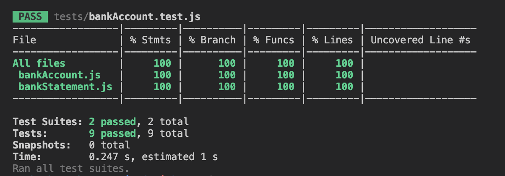

# Bank Tech Test

## Contents

1. [Specification](#specification)
2. [Approach](#approach)
3. [Setting up](#setting-up)
4. [Running the Tests](#running-the-tests)
6. [Run the Code](#run-the-code)
7. [Example](#example)

## 1. Specification

### Requirements

* You should be able to interact with your code via a REPL like IRB or Node.  (You don't need to implement a command line interface that takes input from STDIN.)
* Deposits, withdrawal.
* Account statement (date, amount, balance) printing.
* Data can be kept in memory (it doesn't need to be stored to a database or anything).

### Acceptance criteria

**Given** a client makes a deposit of 1000 on 10-01-2023  
**And** a deposit of 2000 on 13-01-2023  
**And** a withdrawal of 500 on 14-01-2023  
**When** she prints her bank statement  
**Then** she would see

```
date || credit || debit || balance
14/01/2023 || || 500.00 || 2500.00
13/01/2023 || 2000.00 || || 3000.00
10/01/2023 || 1000.00 || || 1000.00
```

## 2. Approach

I designed a class system for the solution. `BankAccount` handles transaction inputs and stores them in an array, whilst `BankStatement` is responsible for compiling the transactions and printing them in the required statement format. The `index.js` file exists to consolidate both classes and run the program faster in the terminal.

## 3. Setting up

The program was built in JavaScript and uses the Jest test suit. This guidance assumes you have NVM (the Node version manager) installed:

```bash
#Setup our environment to use node latest version 
$ nvm use node

# Clone the repository 
$ git clone https://github.com/lizaebadi/bank-tech-test
cd bank-tech-test

# Install dependencies
$ npm install
```

## 4. Tests

100% test coverage was achieved. To run the tests:

```bash
$ npm test
```


## 5. Run the code

1. Run node in the terminal 

```bash
# Run node in the terminal
$ node

# Load the index.js file  
$ .load index.js

# Deposit funds to the account with this command. Choose a value to pass as a parameter (100 has been used as an example)
$ bankAccount.deposit(100);

# Withdraw funds from the account with this command. Choose a value to pass as a parameter (30 has been used as an example)
$ bankAccount.withdrawal(30);

# Further deposits or withdrawals can be made by calling the functions again

# Finally, view the statement
$ bankStatement.printStatement();
```

## 7. Notes

### For further improvement

I would like to test more edge cases and use more error messages.
